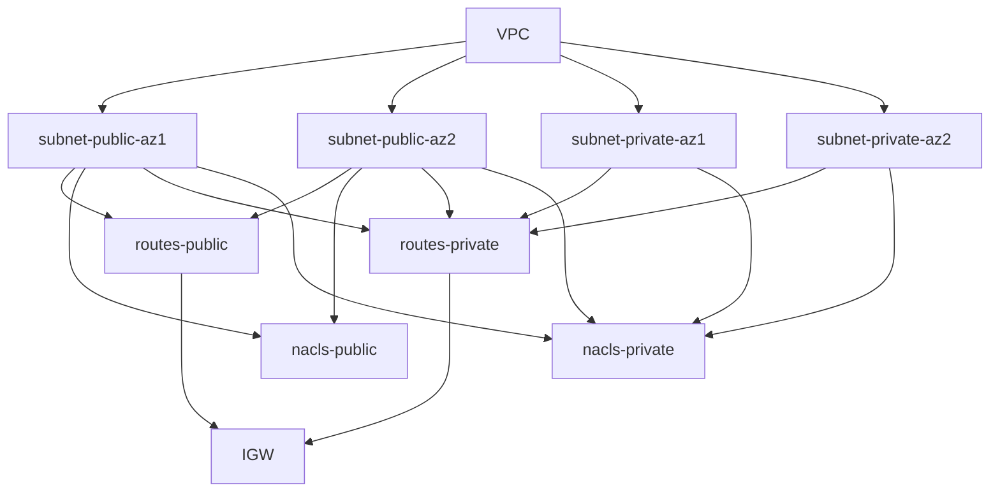

# AWS Notes

### Log in using IAM Identity Center:

Configure a secure developer access method separate from the root billing account.

### Setting up a region:

- Create a `VPC`
  - There is a default VPC automatically created (with IPv4 block: 172.31.0.0/16 ?)
  - Standard "private" IP ranges defined by IANA are:
    - 10.0.0.0 - 10.255.255.255 (10/8 prefix)
    - 172.16.0.0 - 172.31.255.255 (172.16/12 prefix)
    - 192.168.0.0 - 192.168.255.255 (192.168/16 prefix)
  - VPCs can't have overlapping ranges
  - AWS docs have reported 172.16.0.0/16 is used for certain internal functionality
  - *Example:*
    - (Name tag): `tj-frankfurt`
    - (IPv4 CIDR manual input): 172.20.0.0/16
    - No IPv6 CIDR block

- Create `subnets`
  - At least 2 per "availability zone" in the region: 1 "public" + 1 "private"
  - *Example:*
    - `tj-frankfurt-euc1-az1-public` :: 172.20.1.0/24
    - `tj-frankfurt-euc1-az1-private` :: 172.20.10.0/24
    - `tj-frankfurt-euc1-az2-public` :: 172.20.2.0/24
    - `tj-frankfurt-euc1-az2-private` :: 172.20.20.0/24
    - `tj-frankfurt-euc1-az3-public` :: 172.20.3.0/24
    - `tj-frankfurt-euc1-az3-private` :: 172.20.30.0/24

- Delete the default VPC

- Create `internet gateway`
  - *Example:*
    - (Name tag): `tj-frankfurt-igw`
  - Then, attach it to the VPC

- Create `route tables`
  - *Example 1:*
    - (Name tag): `tj-frankfurt-public-routes`
    - Associate all "public" subnets
    - add 0.0.0.0/0 to IGW
    - set as MAIN
  - *Example 2:*
    - (Name tag): `tj-frankfurt-private-routes`
    - Associate all "private" subnets

- Delete default route table

- Create `network ACLs`
  - *Example 1:*
    - (Name tag): `tj-frankfurt-public-nacl`
    - Associate all "public" subnets
    - Add Allow All rules for both Inbound & Outbound
  - *Example 2:*
    - (Name tag): `tj-frankfurt-private-nacl`
    - Associate all "private" subnets
    - Add Allow All rule for Outbound only
    - Add Allow All rule from VPC for Inbound ( 172.20.0.0/16 )

- There is a default NACL which can't be deleted


- Allocate one or more Elastic IP address values, as needed


- Go to ***AWS Systems Manager*** *::* ***Session Manager*** *::* ***Preferences***
 - set an "Idle session timeout" and "Maximum session duration"
 - set the "Linux shell profile" to:
```
exec /bin/bash
cd ~
```

Consider creating an IAM role to associate with EC2 instances, having the permission `AmazonSSMManagedInstanceCore`.
After creating a Linux EC2 resource, as long as `amazon-ssm-agent` is installed, we should be able to connect to it using ***Session Manager***, to get a terminal in the browser.



